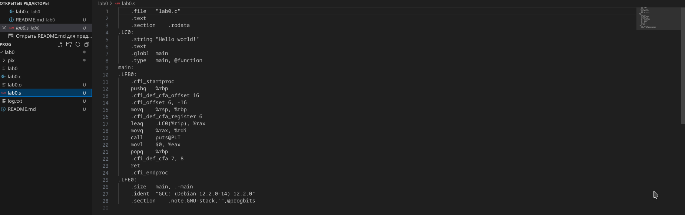
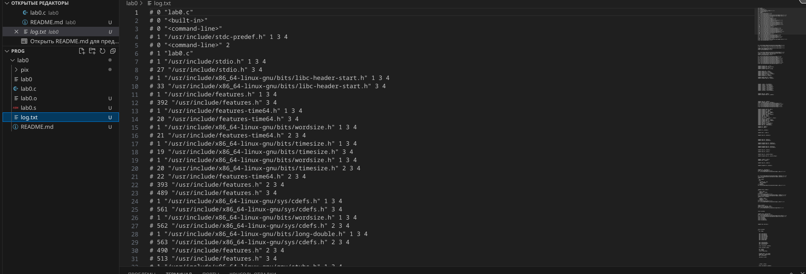
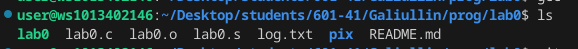

# Отчет
```c
#include <stdio.h>

int main ()
{
    printf("Hello world!\n");
    return 0;
}
```
\

1. Компиляция программы с параметрами


3. Запуск программы


4. Получаем объектный файл


5. Получаем ассемблерный файл


7. Вывод результата в указанный файл 



