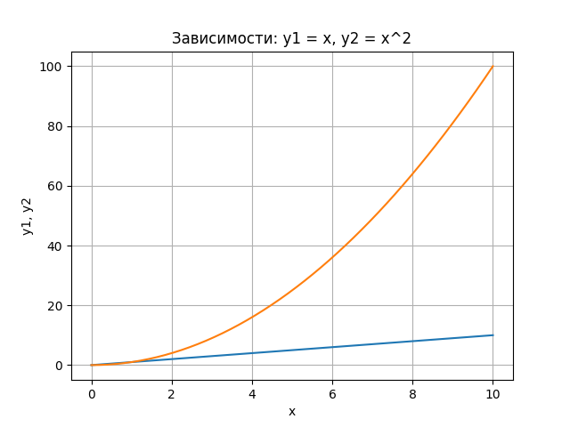
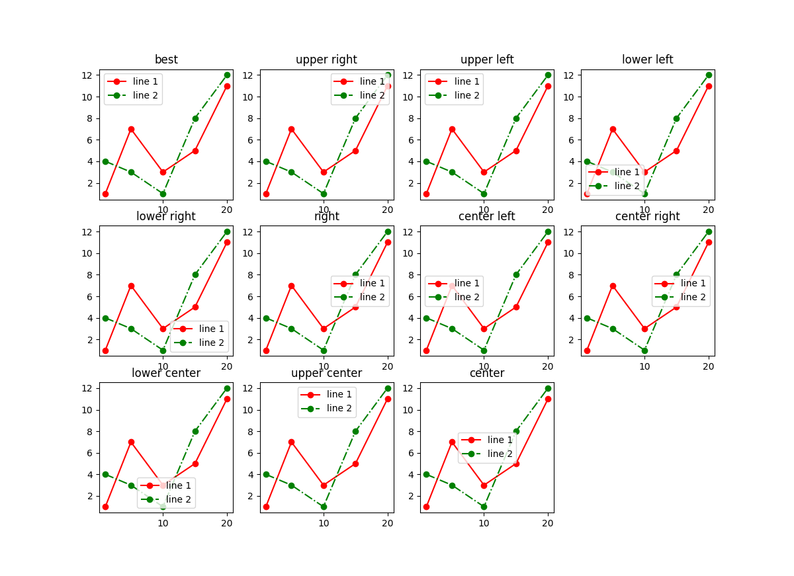
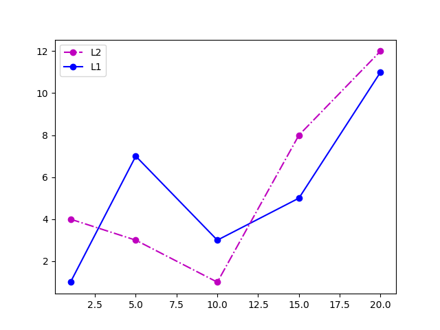
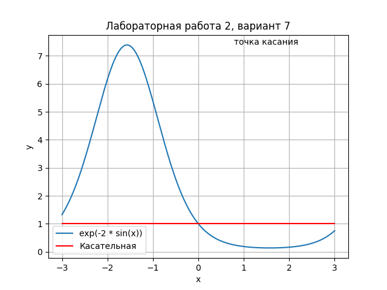

# Лабораторная работа №5
## Уроки из книги
### 1

### 2

### 3


## График функции из своего варианта (вариант 7)
$$
f(x) = e^{-2 sin x}
$$
```python
import matplotlib.pyplot as plt
import numpy as np
from math import *

def f(x):
    return exp(-2 * sin(x))

x = np.linspace(-3, 3, 1000)
y1 = [f(i) for i in x]
y2 = [1 for i in x]
plt.title('Лабораторная работа 2, вариант 7')
plt.xlabel('x')
plt.ylabel('y')
plt.grid()
plt.plot(x, y1, label='exp(-2 * sin(x))')
plt.plot(x, y2, 'r', label='Касательная')
plt.text(0.785, max(y1)+0.01, 'точка касания')
plt.legend()
plt.show()
```

