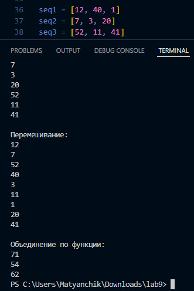

# Лабораторная работа №10
## Вариант 7
## Задача:
1. Создать пакет, содержащий 3 модуля на основе лабораторных работ №7-9
2. Написать запускающий модуль на основе Typer, который позволит выбирать и настраивать параметры запуска логики из пакета.

## Код:
```
import lab7
import lab8
import lab9
import typer

def main(module: str, arg: str):
    if module == '7':
        print(lab7.unpack(arg))
    elif module == '8':
        print(lab8.line(arg)())
    elif module == '9':
        print(lab9.f(arg))
    else:
        print(f"Неизвестный модуль: {module}")

if __name__ == "__main__":
    print("Запускающий модуль")
    typer.run(main)
```


