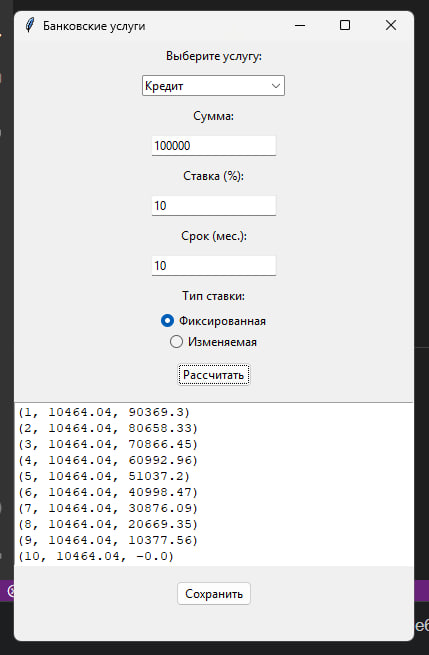
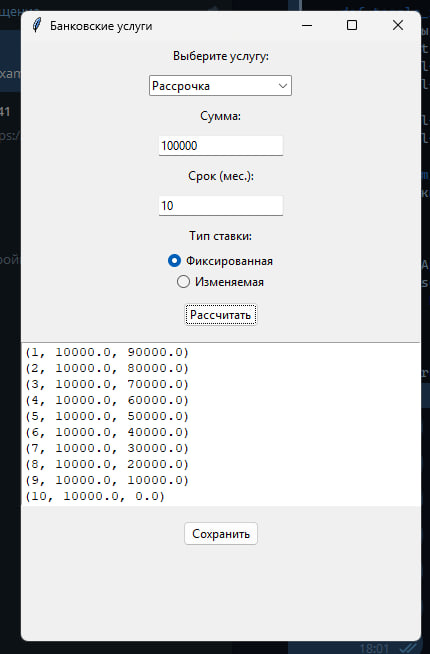
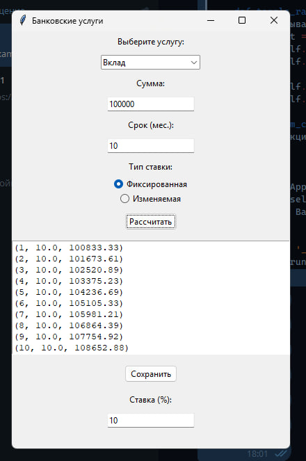
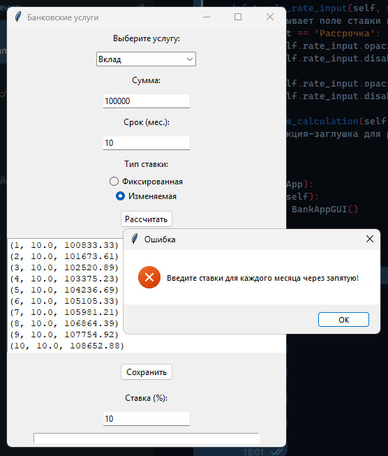
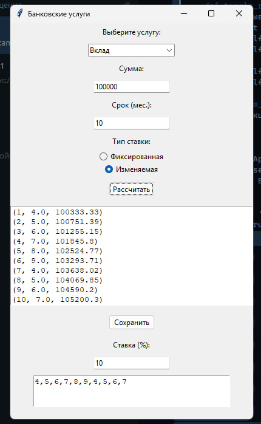

# Лабораторная работа №12
## Вариант 5
## Задача:
По своему варианту задания и GUI фреймворка создайте пакет, содержащий 3 модуля, и подключите его к основной программе. Основная программа должна предоставлять:
1. Графический пользовательский интерфейс с возможностями ввода требуемых параметров и отображения результатов расчёта,
2. Возможность сохранить результаты в отчёт формата .doc или .xls (например, пакеты python-docx и openpyxl).

