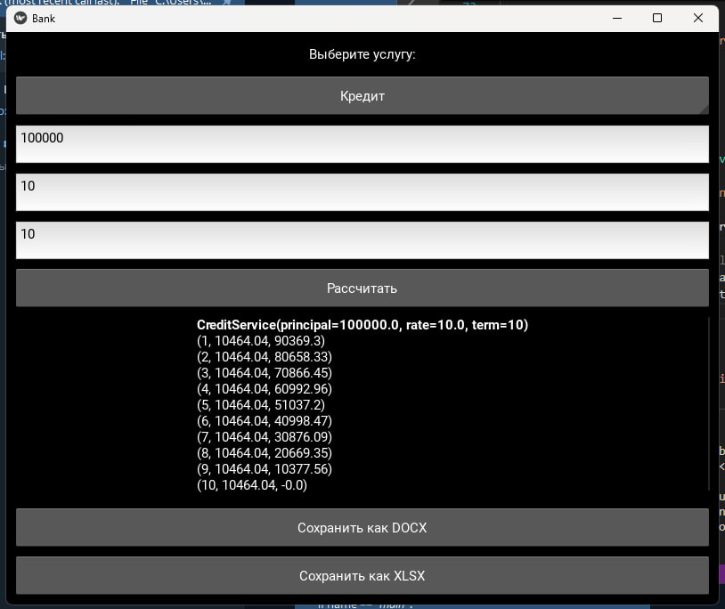
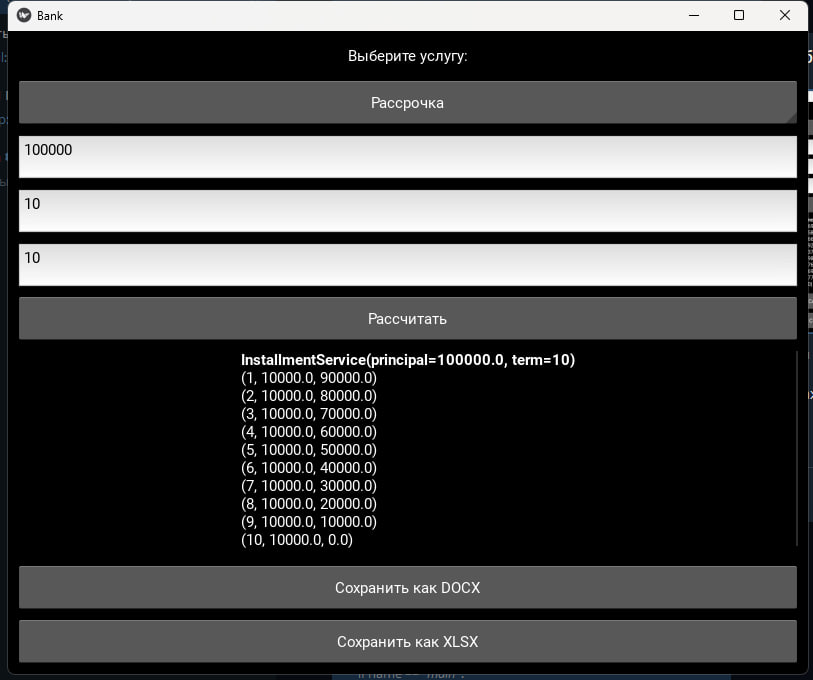
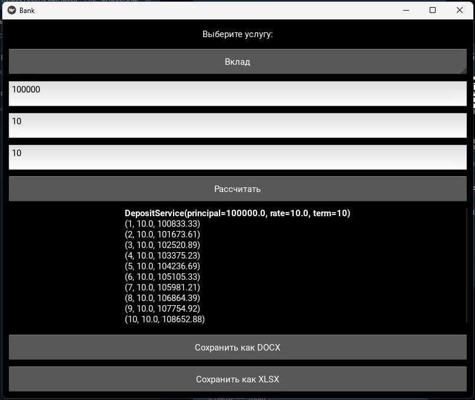

# Лабораторная работа №13
## Вариант 5
## Задача:
Переписать свой вариант лабораторной работы №12 с использованием классов и объектов. Задание то же, вариант GUI фреймворка возьмите следующий по списку. В коде должны присутствовать:
- Абстрактный базовый класс и соотвествующие декораторы для методов
- Иерархия наследования
- Managed - атрибуты
- Минимум 2 dunder-метода у подклассов

