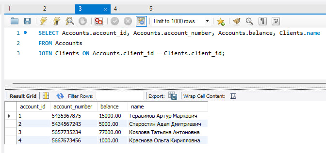
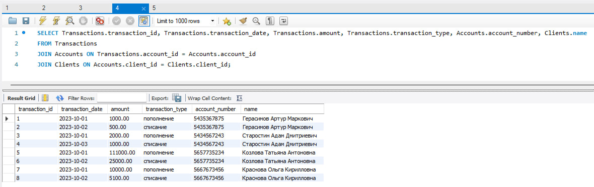
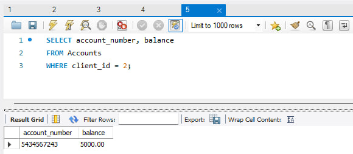
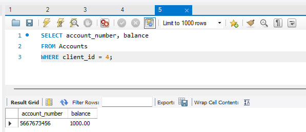

# Лабораторная работа №14
## Вариант 5
## Задача:
1. Спроектировать БД с использованием crow’s foot notation.
2. Создать таблицы БД и заполнить данными.
3. Написать несколько запросов для выборки данных из всех таблиц.

## Задание:
База данных учета финансовых транзакций:
- Таблица Счета с информацией о банковских счетах клиентов, такой как номер счета и текущий баланс.
- Таблица Транзакции с информацией о финансовых транзакциях, такой как дата, сумма и тип операции.
- Таблица Клиенты с информацией о клиентах банка, например, их имена и контактная информация.

