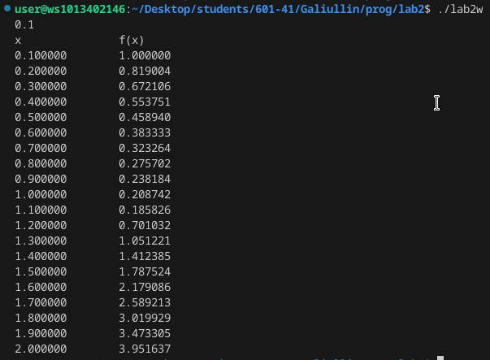
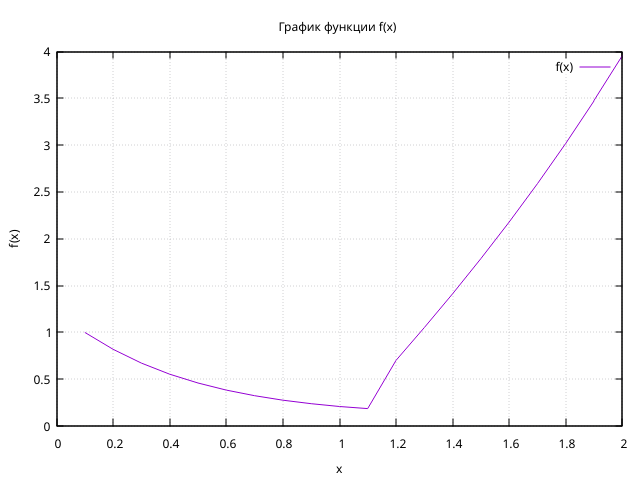

# Лабораторная работа №2
## Вариант 7
## Задание
Написать программу по варианту, используя оператор цикла while.
Написать программу, используя оператор цикла for.
Построить график с использованием gnuplot.
Составить блок-схему.
Оформить отчёт в README.md.

Программа должна выводить на экран таблицу вида:

|$x$       |  $f(x)$  |
|----------|----------|
|0.000000  |  0.123456|
|0.100000  |  1.234567|
|0.200000  |  2.345678|
|...       |  ...     |
|1.000000  |  3.456789|

Шаг $h$ изменения аргумента $x$ необходимо ввести с клавиатуры. Программа должна корректно выводить точки для любого положительного значения $h$.

Функция из варианта 7:

$$
f(x) =
  \begin{cases}
    e^{-2 sin(x)} \text{,}       & -1 \leq x \leq 1 \text{;} \\
    x^2-ctg(x) \text{,} & 1 < x \leq 2 \text{.}
  \end{cases}
$$

## Проделанная работа
1. While:
```c
#include <stdio.h>
#include <math.h>

float f(float x, float h) {
    const float eps = h / 2;
    if (x >= -1.0f - eps && x <= 1.0f + eps)
        return exp(-2 * sin(x));
    else if (x > 1 - eps && x <= 2 + eps)
        return pow(x, 2) - (1.0 / tan(x));
    return 0.0f;
}
int main() {
    float h, x = 0;
    //printf("введите h> "); 
    scanf("%f", &h);
    printf("x\t\tf(x)\n");
    while(x <= 2.0f) {
        printf("%f\t%f\n", x+h, f(x, h));
        x += h;
    }
    return 0;
}
```
2. For:
```c
#include <stdio.h>
#include <math.h>

float f(float x, float h) {
    const float eps = h / 2;
    if (x >= -1.0f - eps && x <= 1.0f + eps)
        return exp(-2 * sin(x));
    else if (x > 1 - eps && x <= 2 + eps)
        return pow(x, 2) - (1.0 / tan(x));
    return 0.0f;
}
int main() {
    float h;
    printf("введите h> ");
    scanf("%f", &h);
    printf("x\t\tf(x)\n");
    for (float x = 0; x <= 2.0f; x += h) {
        printf("%f\t%f\n", x + h, f(x, h));
    }
    return 0;
}
```

3. Скриншот:



4. Блок-схема программы:


5. График функции в gnuplot:


