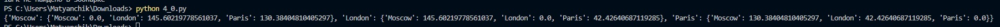
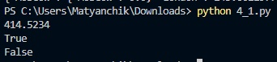
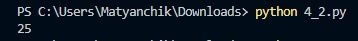
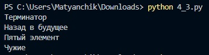
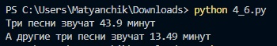
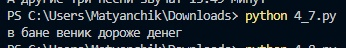
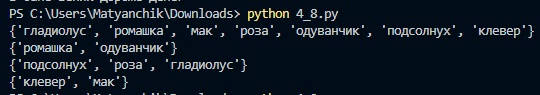

# Лабораторная работа №4

## Задание
1. Скачать архив и распаковать его в репозиторий. В нём 11 заданий, которые нужно выполнить.
2. Оформите отчёт в README.md.

## 00

Составить словарь словарей расстояний между ними.

```
sites = {
    'Moscow': (550, 370),
    'London': (510, 510),
    'Paris': (480, 480),
}

distances = {}

def dist(i, j):
    x1, y1 = sites[i]
    x2, y2 = sites[j]
    return ((x1 - x2) ** 2 + (y1 - y2) ** 2) ** 0.5

names = sites.keys()
for i in names:
    distances[i] = dict((j, dist(i, j)) for j in names)

print(distances)
```



## 01

Выведите на консоль значение прощади этого круга с точностю до 4-х знаков после запятой. Если точка point лежит внутри того самого круга, то выведите на консоль True, Или False, если точка лежит вовне круга. Если точка point_2 лежит внутри круга, то выведите на консоль True, Или False, если точка лежит вовне круга.

```
radius = 42
pi = 3.1415926
print(round(radius * pi ** 2, 4))

point_1 = (23, 34)

def f(p):
    print((p[0] ** 2 + p[1] ** 2) ** 0.5 <= radius)

f(point_1)

point_2 = (30, 30)

f(point_2)
```



## 02

Расставьте знаки операций "плюс", "минус", "умножение" и скобки между числами "1 2 3 4 5" так, что бы получилось число "25".

```
print(1*2+3+4*5)
```



## 03

Выведите на консоль с помощью индексации строки, последовательно:
первый фильм
последний
второй
второй с конца

```
my_favorite_movies = 'Терминатор, Пятый элемент, Аватар, Чужие, Назад в будущее'
print(my_favorite_movies[:10])
print(my_favorite_movies[-15:])
print(my_favorite_movies[12:25])
print(my_favorite_movies[-22:-17])
```



## 04

Создайте списки:
моя семья (минимум 3 элемента)

Выведите на консоль рост отца в формате:
Рост отца - ХХ см

Выведите на консоль общий рост вашей семьи как сумму ростов всех членов:
Общий рост моей семьи - ХХ см

```
my_family = ['dad', 'mom', 'me']
my_family_height = [
    ['dad', 180],
    ['mom', 170],
    ['me', 190]
]
print('Рост отца -', my_family_height[0][1], 'см')
r = 0
for i in my_family_height:
    r += i[1]
print('Общий рост моей семьи -', r, 'см')
```


## 05

Есть список животных в зоопарке.
Посадите медведя (bear) между львом и кенгуру и выведите список на консоль.

Добавьте птиц из списка birds в последние клетки зоопарка и выведите список на консоль.

Уберите слона и выведите список на консоль.

Выведите на консоль в какой клетке сидит лев (lion) и жаворонок (lark). Номера при выводе должны быть понятны простому человеку, не программисту.

```
def f():
    zoo = ['lion', 'kangaroo', 'elephant', 'monkey', ]

    zoo.insert(1, "bear")
    print(zoo)

    birds = ['rooster', 'ostrich', 'lark', ]
    for i in birds:
        zoo.append(i)
    print(zoo)

    zoo.pop(zoo.index("elephant"))
    print(zoo)

    for i in ["lion", "lark"]:
        print(zoo.index(i))

f()

def test(capfd):
    f()
    out, err = capfd.readouterr()
    assert out == "['lion', 'bear', 'kangaroo', 'elephant', 'monkey']\n\
['lion', 'bear', 'kangaroo', 'elephant', 'monkey', 'rooster', 'ostrich', 'lark']\n\
['lion', 'bear', 'kangaroo', 'monkey', 'rooster', 'ostrich', 'lark']\n\
0\n\
6\n"
```


## 06

Есть список песен группы Depeche Mode со временем звучания с точностью до долей минут. Точность указывается в функции round(a, b) где a, это число которое надо округлить, а b количество знаков после запятой.

```
violator_songs_list = [
    ['World in My Eyes', 4.86],
    ['Sweetest Perfection', 4.43],
    ['Personal Jesus', 4.56],
    ['Halo', 4.9],
    ['Waiting for the Night', 6.07],
    ['Enjoy the Silence', 4.20],
    ['Policy of Truth', 4.76],
    ['Blue Dress', 4.29],
    ['Clean', 5.83],
]
t = round(sum(i[1] for i in violator_songs_list), 2)
print('Три песни звучат', t, 'минут')
violator_songs_dict = {
    'World in My Eyes': 4.76,
    'Sweetest Perfection': 4.43,
    'Personal Jesus': 4.56,
    'Halo': 4.30,
    'Waiting for the Night': 6.07,
    'Enjoy the Silence': 4.6,
    'Policy of Truth': 4.88,
    'Blue Dress': 4.18,
    'Clean': 5.68,
}
t = sum(violator_songs_dict[i] for i in ['Sweetest Perfection', 'Policy of Truth', 'Blue Dress'])
print('А другие три песни звучат', round(t, 2), 'минут')
```



## 07

Есть зашифрованное сообщение. Нужно его расшифровать и вывести на консоль в удобочитаемом виде. Должна получиться фраза на русском языке.

```
secret_message = [
    'квевтфпп6щ3стмзалтнмаршгб5длгуча',
    'дьсеы6лц2бане4т64ь4б3ущея6втщл6б',
    'т3пплвце1н3и2кд4лы12чф1ап3бкычаь',
    'ьд5фму3ежородт9г686буиимыкучшсал',
    'бсц59мегщ2лятьаьгенедыв9фк9ехб1а',
]
s = secret_message
print(s[0][3], s[1][9:13], s[2][5:15:2], s[3][12:6:-1], s[4][20:15:-1])
```



## 08

Создайте множество цветов, произрастающих в саду и на лугу.
Выведите на консоль все виды цветов.
Выведите на консоль те, которые растут и там и там.
Выведите на консоль те, которые растут в саду, но не растут на лугу.
Выведите на консоль те, которые растут на лугу, но не растут в саду.

```
garden = ('ромашка', 'роза', 'одуванчик', 'ромашка', 'гладиолус', 'подсолнух', 'роза', )
meadow = ('клевер', 'одуванчик', 'ромашка', 'клевер', 'мак', 'одуванчик', 'ромашка', )
garden_set = set(garden)
meadow_set = set(meadow)
print(garden_set.union(meadow_set))
print(garden_set.intersection(meadow_set))
print(garden_set.difference(meadow_set))
print(meadow_set.difference(garden_set))
```



## 09

Есть словарь магазинов с распродажами. Создайте словарь цен на продкты следующего вида. Указать надо только по 2 магазина с минимальными ценами.

```
shops = {
    'ашан':
    [
        {'name': 'печенье', 'price': 10.99},
        {'name': 'конфеты', 'price': 34.99},
        {'name': 'карамель', 'price': 45.99},
        {'name': 'пирожное', 'price': 67.99}
    ],
    'пятерочка':
    [
        {'name': 'печенье', 'price': 9.99},
        {'name': 'конфеты', 'price': 32.99},
        {'name': 'карамель', 'price': 46.99},
        {'name': 'пирожное', 'price': 59.99}
    ],
    'магнит':
    [
        {'name': 'печенье', 'price': 11.99},
        {'name': 'конфеты', 'price': 30.99},
        {'name': 'карамель', 'price': 41.99},
        {'name': 'пирожное', 'price': 62.99}
    ],
}
sweets = {
    'печенье': [
        {'shop': 'ашан', 'price': 10.99},
        {'shop': 'пятерочка', 'price': 9.99},
        {'shop': 'магнит', 'price': 11.99},
    ],
    'конфеты': [
        {'shop': 'ашан', 'price': 34.99},
        {'shop': 'пятерочка', 'price': 32.99},
        {'shop': 'магнит', 'price': 30.99},
    ],
    'карамель': [
        {'shop': 'ашан', 'price': 45.99},
        {'shop': 'пятерочка', 'price': 46.99},
        {'shop': 'магнит', 'price': 41.99},
    ],
    'пирожное': [
        {'shop': 'ашан', 'price': 67.99},
        {'shop': 'пятерочка', 'price': 59.99},
        {'shop': 'магнит', 'price': 62.99},
    ],
}
for i in sweets.keys():
    print(i)
    i = sweets[i]
    if i[0]['price'] < i[1]['price']:
        print(i[0]['shop'])
        if i[1]['price'] < i[2]['price']: print(i[1]['shop'])
        else: print(i[2]['shop'])
    elif i[1]['price'] < i[0]['price']:
        print(i[1]['shop'])
        if i[0]['price'] < i[2]['price']: print(i[0]['shop'])
        else: print(i[2]['shop'])
```


## 10

Есть словарь кодов товаров. Есть словарь списков количества товаров на складе. Рассчитать на какую сумму лежит каждого товара на складе. 

Вывести стоимость каждого вида товара на складе:
один раз распечать сколько всего столов и их общая стоимость, один раз распечать сколько всего стульев и их общая стоимость, и т.д. на складе

```
goods = {
    'Лампа': '12345',
    'Стол': '23456',
    'Диван': '34567',
    'Стул': '45678',
}
store = {
    '12345': [
        {'quantity': 27, 'price': 42},
    ],
    '23456': [
        {'quantity': 22, 'price': 510},
        {'quantity': 32, 'price': 520},
    ],
    '34567': [
        {'quantity': 2, 'price': 1200},
        {'quantity': 1, 'price': 1150},
    ],
    '45678': [
        {'quantity': 50, 'price': 100},
        {'quantity': 12, 'price': 95},
        {'quantity': 43, 'price': 97},
    ],
}
lamps_cost = store[goods['Лампа']][0]['quantity'] * store[goods['Лампа']][0]['price']
lamp_code = goods['Лампа']
lamps_item = store[lamp_code][0]
lamps_quantity = lamps_item['quantity']
lamps_price = lamps_item['price']
lamps_cost = lamps_quantity * lamps_price
print('Лампа -', lamps_quantity, 'шт, стоимость', lamps_cost, 'руб')
table_code = goods['Стол']
table_item = store[table_code][0]
table_quantity = table_item['quantity']
table_price = table_item['price']
table_cost = table_quantity * table_price
print('Стол -', table_quantity, 'шт, стоимость', table_cost, 'руб')
sofa_code = goods['Диван']
sofa_item = store[sofa_code][0]
sofa_quantity = sofa_item['quantity']
sofa_price = sofa_item['price']
sofa_cost = sofa_quantity * sofa_price
print('Диван -', sofa_quantity, 'шт, стоимость', sofa_cost, 'руб')
chair_code = goods['Стул']
chair_item = store[chair_code][0]
chair_quantity = chair_item['quantity']
chair_price = chair_item['price']
chair_cost = chair_quantity * chair_price
print('Стул -', chair_quantity, 'шт, стоимость', chair_cost, 'руб')
```


