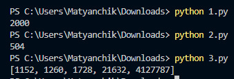

# Лабораторная работа №6
## Вариант 7

### Задача 1
Иван составляет таблицу кодовых слов для передачи сообщений, каждому сообщению соответствует своё кодовое слово. В качестве кодовых слов Иван использует все пятибуквенные слова в алфавите {A, B, C, D, E}, удовлетворяющие такому условию: кодовое слово не может начинаться с буквы E и заканчиваться буквой A. Сколько различных кодовых слов может использовать Иван?


```
total_words = 5 ** 5
words_starting_with_E = 5 ** 4
words_ending_with_A = 5 ** 4
words_starting_with_E_and_ending_with_A = 5 ** 3

invalid_words = (words_starting_with_E + words_ending_with_A - 
                 words_starting_with_E_and_ending_with_A)

valid_words = total_words - invalid_words
print(valid_words)  # Вывод: 2000
```

### Задача 2
Сколько единиц содержится в двоичной записи значения выражения: 4^{511}+2^{511}-511?

```
result = 4**511 + 2**511 - 511

count_of_ones = bin(result).count('1')

print(count_of_ones)
```

### Задача 3
Пусть M(N)  — произведение 5 наименьших различных натуральных делителей натурального числа N, не считая единицы. Если у числа N меньше 5 таких делителей, то M(N) считается равным нулю. Найдите 5 наименьших натуральных чисел, превышающих 200 000 000, для которых 0 < M(N) < N. В ответе запишите найденные значения M(N) в порядке возрастания соответствующих им чисел.

```
def smallest_divisors(n):
    divisors = []
    for i in range(2, int(n**0.5) + 1):
        if n % i == 0:
            divisors.append(i)
            if i != n // i:
                divisors.append(n // i)
    divisors.sort()
    return divisors[:5]

def M(N):
    divs = smallest_divisors(N)
    if len(divs) < 5:
        return 0
    product = 1
    for d in divs:
        product *= d
    return product

numbers_found = []
n = 200_000_001

while len(numbers_found) < 5:
    m_value = M(n)
    if 0 < m_value < n:
        numbers_found.append(m_value)
    n += 1

numbers_found.sort()
print(numbers_found)
```



## Ссылки на используемые материалы
https://evil-teacher.on.fleek.co/prog_pm/term1/lab06/<br>
https://habr.com/ru/companies/otus/articles/529356/<br>
https://docs.python.org/3/library/itertools.html<br>
https://proglib.io/p/iteriruemsya-pravilno-20-priemov-ispolzovaniya-v-python-modulya-itertools-2020-01-03
