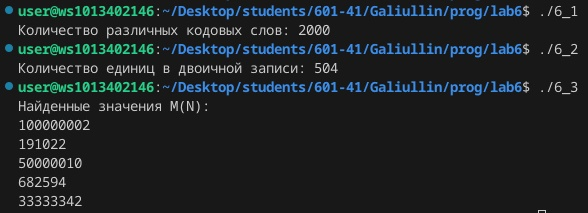

# Лабораторная работа №6
## Вариант 7

### Задача 1
Иван составляет таблицу кодовых слов для передачи сообщений, каждому сообщению соответствует своё кодовое слово. В качестве кодовых слов Иван использует все пятибуквенные слова в алфавите {A, B, C, D, E}, удовлетворяющие такому условию: кодовое слово не может начинаться с буквы E и заканчиваться буквой A. Сколько различных кодовых слов может использовать Иван?


```
#include <stdio.h>

int main() {
    int total_words = 5 * 5 * 5 * 5 * 5;    
    int starting_with_E = 5 * 5 * 5 * 5;
    int ending_with_A = 5 * 5 * 5 * 5;
    int starting_with_E_and_ending_with_A = 5 * 5 * 5;
    int invalid_words = starting_with_E + ending_with_A -
starting_with_E_and_ending_with_A;
    int valid_words = total_words - invalid_words;
    printf("Количество различных кодовых слов: %d\n", valid_words);
    return 0;
}
```

### Задача 2
Сколько единиц содержится в двоичной записи значения выражения: $4^{511}+2^{511}-511?

```
#include <stdio.h>
#include <gmp.h>

int count_ones(const mpz_t number) {
    int count = 0;
    mpz_t temp;
    mpz_init(temp);
    mpz_set(temp, number);
    while (mpz_cmp_ui(temp, 0) > 0) {
        count += mpz_tstbit(temp, 0);
        mpz_fdiv_q_2exp(temp, temp, 1);
    }
    mpz_clear(temp);
    return count;
}
int main() {
    mpz_t value;
    mpz_init(value);
    mpz_ui_pow_ui(value, 2, 1022);
    mpz_t temp;
    mpz_init(temp);
    mpz_ui_pow_ui(temp, 2, 511);
    mpz_add(value, value, temp);
    mpz_sub_ui(value, value, 511);
    int ones_count = count_ones(value);
    printf("Количество единиц в двоичной записи: %d\n", ones_count);
    mpz_clear(value);
    mpz_clear(temp);
    return 0;
}
```

### Задача 3
Пусть M(N)  — произведение 5 наименьших различных натуральных делителей натурального числа N, не считая единицы. Если у числа N меньше 5 таких делителей, то M(N) считается равным нулю. Найдите 5 наименьших натуральных чисел, превышающих 200 000 000, для которых 0 < M(N) < N. В ответе запишите найденные значения M(N) в порядке возрастания соответствующих им чисел.

```
#include <stdio.h>
#include <stdlib.h>

#define TARGET_COUNT 5
#define START_NUMBER 200000000

int find_smallest_divisors(unsigned long long N, unsigned long long *divisors) {
    int count = 0;
    for (unsigned long long i = 2; i * i <= N && count < TARGET_COUNT; i++) {
        if (N % i == 0) {
            divisors[count++] = i;
            while (N % i == 0) {
                N /= i;
            }
        }
    }
    if (N > 1 && count < TARGET_COUNT) {
    divisors[count++] = N;
    }
    return count;
}
unsigned long long calculate_M(unsigned long long N) {
    unsigned long long divisors[TARGET_COUNT];
    int count = find_smallest_divisors(N, divisors);
    if (count < TARGET_COUNT) {
        return 0;
    }
    unsigned long long M = 1;
    for (int i = 0; i < TARGET_COUNT; i++) {
        M *= divisors[i];
}
return M;
}
int main() {
    unsigned long long N = START_NUMBER + 1;
    unsigned long long M_values[5];
    int found_count = 0;
    while (found_count < 5) {
    unsigned long long M = calculate_M(N);
    if (M > 0 && M < N) {
        M_values[found_count++] = M;
    }
        N++;
    }
    printf("Найденные значения M(N):\n");
    for (int i = 0; i < 5; i++) {
        printf("%llu\n", M_values[i]);
    }
    return 0;
}
```



## Ссылки на используемые материалы
https://evil-teacher.on.fleek.co/prog_pm/term1/lab06/<br>
https://habr.com/ru/companies/otus/articles/529356/<br>
https://docs.python.org/3/library/itertools.html<br>
https://proglib.io/p/iteriruemsya-pravilno-20-priemov-ispolzovaniya-v-python-modulya-itertools-2020-01-03
