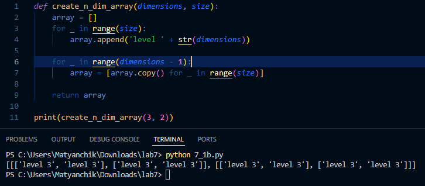
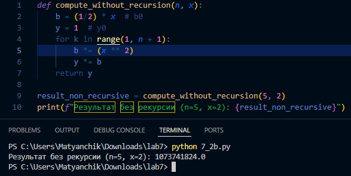

# Лабораторная работа №7
## Вариант 3
### Задача 1:
Функция для создания n-мерных массивов.
```
>>> create_n_dim_array(2, 3)
[
    ['level 2', 'level 2', 'level 2'],
    ['level 2', 'level 2', 'level 2'],
    ['level 2', 'level 2', 'level 2']
]
>>> create_n_dim_array(3, 2)
[
    [
        ['level 3', 'level 3'],
        ['level 3', 'level 3'],
    ], 
    [
        ['level 3', 'level 3'],
        ['level 3', 'level 3'],
    ]
]
```

#### С рекурсией
```
def create_n_dim_array_recursive(dimensions, size):
    if dimensions == 1:
        return ['level ' + str(dimensions)] * size
    else:
        return [create_n_dim_array_recursive(dimensions - 1, size) for _ in range(size)]

print(create_n_dim_array_recursive(3, 2))
```


#### Без рекурсии
```
def create_n_dim_array(dimensions, size):
    array = []
    for _ in range(size):
        array.append('level ' + str(dimensions))
    
    for _ in range(dimensions - 1):
        array = [array.copy() for _ in range(size)]
    
    return array

print(create_n_dim_array(3, 2))
```


### Задача 2
Функция для расчёта Y(k) = b(k)Y(k−1). Y(o) = 1, b(k) = b(k−1)x^2, b(o) = 1/2x,x ≠ 0.
#### С рекурсией
```
def compute_with_recursion(k, x):
    if k == 0:
        return 1
    else:
        b_prev = compute_b(k - 1, x)
        b_k = b_prev * (x ** 2)
        return b_k * compute_with_recursion(k - 1, x)

def compute_b(k, x):
    if k == 0:
        return (1/2) * x
    else:
        return compute_b(k - 1, x) * (x ** 2)
    
result_recursive = compute_with_recursion(5, 2)
print(f"Результат с рекурсией (n=5, x=2): {result_recursive}")
```


#### Без рекурсии
```
def compute_without_recursion(n, x):
    b = (1/2) * x  # b0
    y = 1  # y0
    for k in range(1, n + 1):
        b *= (x ** 2)
        y *= b
    return y

result_non_recursive = compute_without_recursion(5, 2)
print(f"Результат без рекурсии (n=5, x=2): {result_non_recursive}")
```

